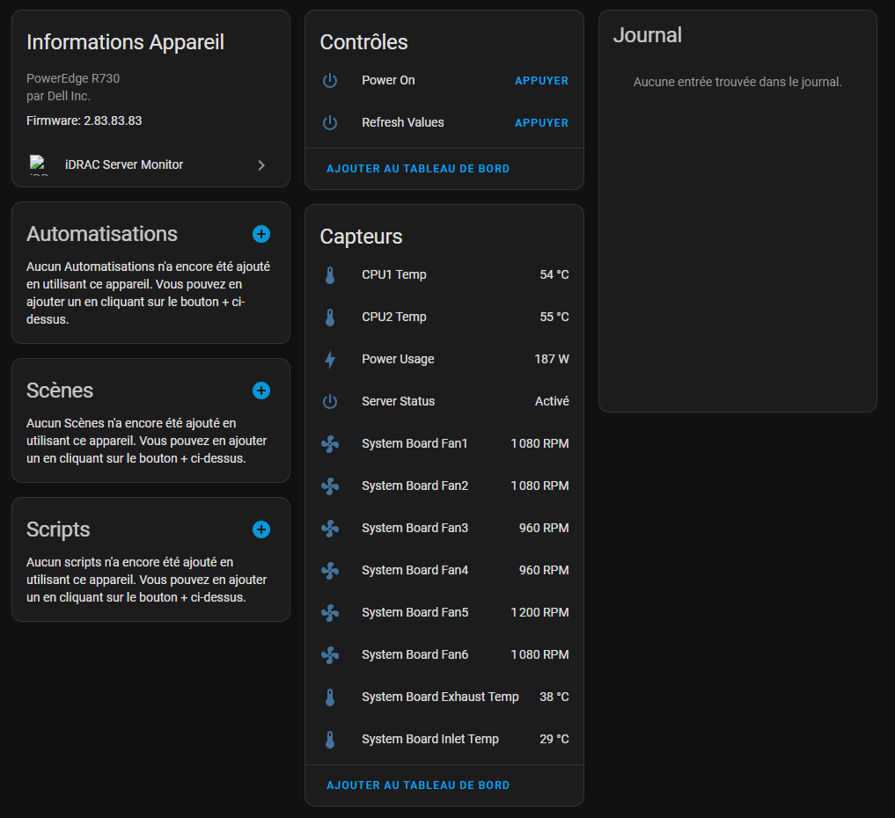

# iDRAC Server Monitor

This integration will grab infomations from your Dell servers' iDrac system :

- Server status
- Power consumption
- CPU and air temperature
- Fan speed

Youc can also start the server from Home Assistant.

For this to work, the Redfish service must be running on it.

Tested on iDrac 8 on Dell PowerEdge R730 servers.

## Screenshots

## Installation

1. Install this integration with HACS, or copy the contents of this
   repository into the `custom_components/idrac_power` directory
2. Restart HA
3. Go to `Configuration` -> `Integrations` and click the `+ Add Integration`
   button
4. Select `iDrac power monitor` from the list
5. Enter the IP address or hostname (NO `http://` !) of your iDrac instance, its username (`root` by default) and its password (`calvin` by default).
