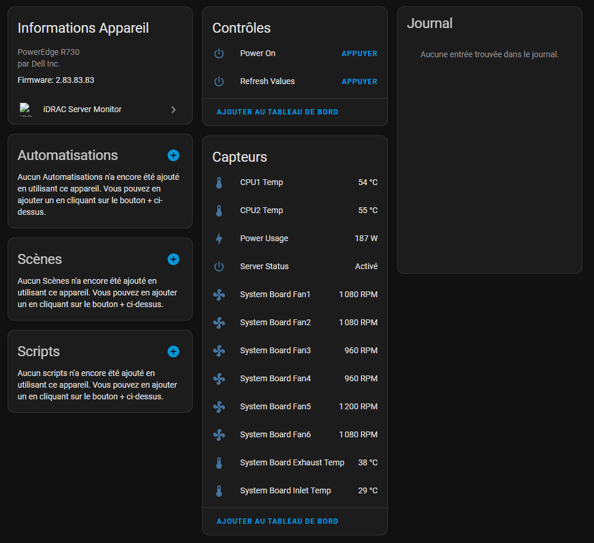

# iDRAC power monitor

## Changelog

### 1.6.1
- Fix firmware version overwriting device info, causing platform setup failures on concurrent load
- Fix power sensor showing "unavailable" instead of 0W when server is in standby
- Fix binary status sensor showing "unavailable" instead of "off" when server is powered down
- Add `async_unload_entry` to properly stop background polling and clean up on integration reload

This integration will grab infomations from your Dell servers' iDRAC system :

- Server status
- Power consumption
- CPU and air temperature
- Fan speed

You can also start and shutdown the server from Home Assistant.

For this to work, the Redfish service must be running on it.

Tested on iDRAC 7 and 8 on multiple Dell PowerEdge servers.

## Screenshots

## Installation

> **Note**
> 
> This integration requires [HACS](https://github.com/hacs/integration) to be installed

1. Open HACS
2. `+ EXPLORE & DOWNLOAD REPOSITORIES`
3. Find `iDRAC power monitor` in this list
4. `DOWNLOAD THIS REPOSITORY WITH HACS`
5. `DOWNLOAD`
6. Restart Home Assistant (_Settings_ > _System_ > _RESTART_)
7. Go to `Configuration` -> `Integrations` and click the `+ Add Integration`
   button
8. Select `iDRAC power monitor` from the list
9. Enter the IP address or hostname (NO `http://` !) of your iDRAC instance, its username (`root` by default) and its password (`calvin` by default).
