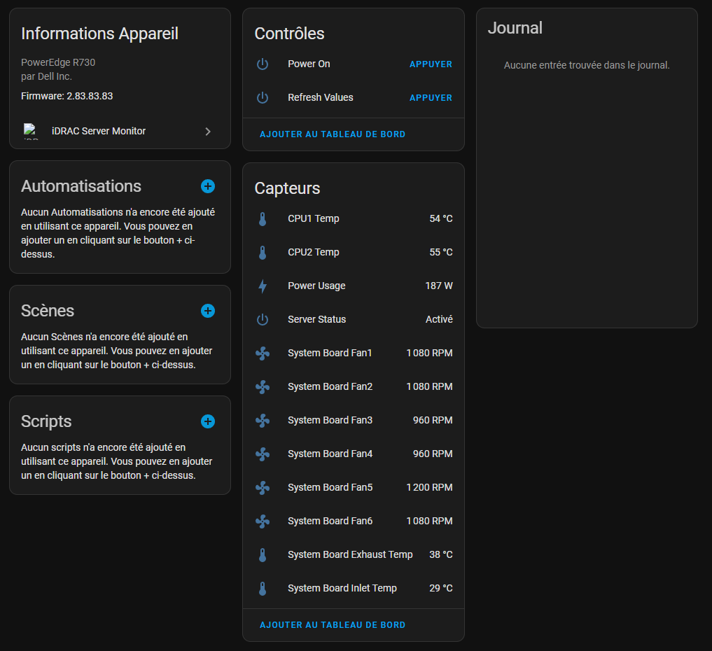

# iDRAC power monitor

[](https://github.com/hacs/integration)

Monitor and control Dell PowerEdge servers from Home Assistant through their iDRAC, from **iDRAC 6 to iDRAC 9**:

- Server power state, with power on / graceful shutdown (switch and buttons)
- Power usage (W) and cumulative energy consumption (kWh, usable in the Energy dashboard)
- Temperatures and fan speeds
- Hardware health and per power supply health (problem sensors, e.g. to shut down when a PSU loses input)

No extra Python dependency: everything goes through the iDRAC's own HTTPS APIs.

## Supported iDRACs

| iDRAC | API used | Notes |
|---|---|---|
| iDRAC 9 | Redfish | Recent firmware (no `/Power` / `/Thermal`) handled through `EnvironmentMetrics`, `ThermalSubsystem` and `Sensors`. Energy from Redfish, or from the iDRAC web API when Redfish lacks it. |
| iDRAC 7 / 8 | Redfish, energy from the web GUI API | If Redfish is missing (old firmware) or disabled, the web GUI API is used for everything. |
| iDRAC 6 | Web GUI API (`/data`) | iDRAC 6 has no Redfish. Old TLS (1.0) and small keys are accepted. |

The API is detected when the server is added and remembered.

> **Note on iDRAC 6 sessions:** an iDRAC 6 only accepts a few simultaneous web sessions. The integration keeps a single one open and closes it when unloaded. If adding the server fails with "all its sessions are in use", log out of the iDRAC web interface (or wait for the idle sessions to expire) and try again.

## Installation

> **Note**
>
> This integration requires [HACS](https://github.com/hacs/integration) to be installed

1. Open HACS
2. `+ EXPLORE & DOWNLOAD REPOSITORIES`
3. Find `iDRAC power monitor` in this list
4. `DOWNLOAD THIS REPOSITORY WITH HACS`
5. `DOWNLOAD`
6. Restart Home Assistant (_Settings_ > _System_ > _RESTART_)
7. _Settings_ > _Devices & services_ > _Add integration_ > `iDRAC power monitor`
8. Enter the IP address or hostname of the iDRAC, its username (`root` by default) and password (`calvin` by default).

Host, username and password can be changed later with _Reconfigure_ on the integration entry; the polling interval with _Configure_.

## Troubleshooting

`scripts/idrac_probe.py` queries an iDRAC with the integration's own code and prints what it reads (`--raw` adds the XML of the iDRAC 6 web API). Run it from a clone of this repository in an environment where Home Assistant is installed, and attach its output to issues about missing or wrong readings:

```
python scripts/idrac_probe.py 192.168.1.120 root calvin --raw
```

## Screenshots



## Changelog

### 2.0.0
- iDRAC 6 support through the iDRAC web GUI API, without any new dependency (upstream #32, supersedes upstream PR #44 which needed IPMI)
- iDRAC 7/8 without Redfish (old firmware, or Redfish disabled) now fall back to the same web API instead of failing
- iDRAC 9: fans and temperatures from `ThermalSubsystem`/`Sensors` when `/Thermal` is missing or incomplete, power and energy from `EnvironmentMetrics` (upstream #19, #36, based on upstream PR #38 with its odata path bug fixed and without the hardcoded model list)
- "Server status" and the power switch now follow the host power state; they used the chassis health state and showed "running" on powered-off servers (upstream #19)
- New hardware health and per power supply problem sensors (upstream #25, #29)
- Host, username and password can be changed with _Reconfigure_, the polling interval with _Configure_; expired credentials trigger a re-authentication prompt (upstream #37)
- A pasted `https://…` URL is accepted as host; a server can no longer be added twice
- Energy: no more `sysmgmt` login on every poll when Redfish already provides the counter; the energy sensor is only created when the iDRAC provides energy data
- Rewritten on Home Assistant's `DataUpdateCoordinator` and `aiohttp`: no more blocking `requests` calls, 45 s request timeout instead of 300 s, entities become unavailable when the iDRAC is unreachable
- Entity unique ids are unchanged: upgrading keeps entity ids and history (friendly names lose the duplicated model, e.g. "PowerEdge R720 Power usage")

### 1.7.0
- Add firmware version detection to disable legacy `/data` endpoint on iDRAC 9 firmware 7.x+ (fixes #41)
- Prefer Redfish `PowerMetrics.EnergyConsumedKWh` for energy consumption over legacy endpoint
- Fix error log spam on firmware that removed the `/data/login` endpoint
- Fix potential `NameError` in legacy endpoint logout when login fails

### 1.6.1
- Fix firmware version overwriting device info, causing platform setup failures on concurrent load
- Fix power sensor showing "unavailable" instead of 0W when server is in standby
- Fix binary status sensor showing "unavailable" instead of "off" when server is powered down
- Add `async_unload_entry` to properly stop background polling and clean up on integration reload
